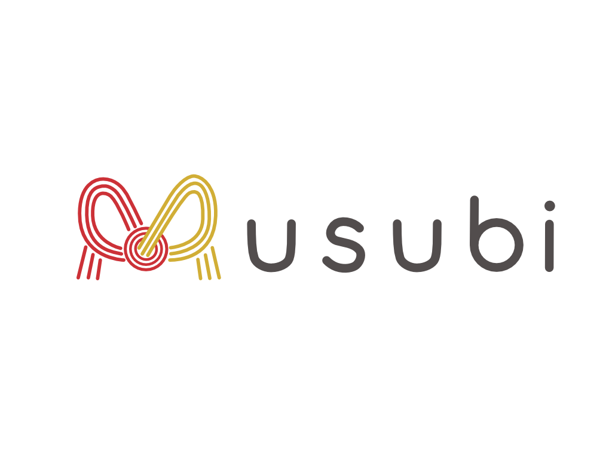

  

  <strong>Blender で、チーム制作をはじめる。</strong>

  <strong>日本語</strong> · English (準備中)

---

ギガファイル便のリンクを貼らなくていい。
`c01_final_final2.blend` を作らなくていい。
「最新どれ?」と聞かなくていい。

いつもどおり **`Ctrl+S` で保存するだけ**。ファイルはメンバーのPCに届き、
履歴が残り、いま誰がどのカットを触っているかが全員に見えます。

## これがあると、こうなります

| これまで | Musubi を入れると |
|---|---|
| 「最新のファイル送って」とチャットする | 保存すれば数十秒で相手のPCに届いている |
| `c01_v003_final_final.blend` が増える | ファイル名はひとつ。過去は自動で履歴に残る |
| 気づいたら2人で同じカットを直していた | 開いた瞬間にロックが付き、他の人には警告が出る |
| 誰がどこまで進んだか分からない | 進行ボードが全員で共有される(Blenderがない人にも渡せる) |
| クラウドの月額を払う / サーバーを立てる | どちらもいりません。PC同士が直接つながります |

## 必要なもの

| | |
|---|---|
| Blender | 4.2 以降 |
| 追加でインストールするもの | **なし。**アドオンを入れるだけです |
| 料金・アカウント登録 | **なし。**サーバーもクラウド契約も使いません |
| OS | Windows は全機能。macOS / Linux は履歴・進行ボード・品質チェックが動きます([詳しく](#動作環境の細かい話)) |
| 表示言語 | 日本語のみ |

## 入れかた

1. [Releases](https://github.com/mochizukimonta/musubi-pipeline/releases) から
   `musubi_pipeline-x.y.z.zip` をダウンロード
2. Blender のウィンドウに zip をドラッグ&ドロップ
3. サイドバー(`N` キー)に **Musubi** タブが出ます

## はじめかた

チームで**ひとりだけ**が「立ち上げる人」になります。あとは全員「参加する人」です。

### 立ち上げる人(最初の1回)

1. プロジェクト用のフォルダを作って「ルート」に指定
2. **フォルダ構造を作成** — 映像制作 / アセット制作 / 最小構成 から選ぶ
3. **① 同期を始める** — 招待ファイルが書き出されます
4. その招待ファイルを、チャットでメンバーに送る
5. 参加申請が来たら、**デバイスID を本人に確認してから**承認する

### 参加する人(最初の1回)

1. 空のフォルダを作って「ルート」に指定
2. **① 招待ファイルで参加** — もらったファイルを選ぶだけ
3. 承認されると、プロジェクトの中身が流れ込んできます

IDやパスワードの入力は**一度もありません**。招待ファイルが全部やります。

### 2回目からは

普通に `Ctrl+S` で保存してください。履歴もロックも進捗も自動です。
新しいカットを始めるときだけ、シーン/カット番号を入れて「カットとして配置保存」を押します。

## こまったときは

| | |
|---|---|
| [チーム制作ガイド](docs/ja/チーム制作ガイド.md) | **まずこれ。**チームに参加する人にそのまま渡せます |
| [機能リファレンス](docs/ja/機能リファレンス.md) | 進行ボード・レビュー・品質チェックなど、全機能の説明 |
| [安全性について](docs/ja/セキュリティ設計.md) | 会社や学校で使うか検討している人へ |

## 仕組みが気になる人へ

ファイルはどうやって届いているの?

ファイルの転送そのものは [Syncthing](https://syncthing.net/) という P2P 同期ソフトに
任せています。暗号化も NAT 越えも実績のある実装に委ねて、自作していません。
Windows では公式 GitHub リリースから SHA-256 検証つきで自動取得します。

その上で Musubi がやっているのは、**「本当に全員のファイルが一致しているか」の検証**です。
共有フォルダは「同期済み」としか言ってくれないので、全ファイルのハッシュ照合リストを
端末ごとに書き出して突き合わせ、**一致 / 未到達 / 差分 / こちらのみ**を報告します。

このアドオンが自分に課している約束

- **作業を妨げない。** 常駐スレッドもタイマーも持ちません。状態を見るのは
  「開いた時 / 保存した時 / ボタンを押した時」だけで、保存を遅くしません
- **同期プロトコルを自作しない。** 暗号・鍵交換・NAT越えは Syncthing に委任します
- **同期フォルダに秘密を書かない。** API キーは同期対象外のローカル領域に置きます
- **同期フォルダを信頼しない。** 他人が書き込めるフォルダなので、読むものは検証します
- **勝手に直さない。** 品質チェックは警告するだけ。保存は止めず、修正は明示ボタンだけ

動作環境の細かい話

Syncthing の自動導入に対応しているのは Windows だけです。
macOS / Linux でも、バージョン管理・進行ボード・品質チェック・レビューはそのまま動きます。
Syncthing をご自分で用意すれば、同期の検証も動きます。

## 開発に参加する

コードを読む・直す人向けの入口は [CONTRIBUTING.md](CONTRIBUTING.md) にまとめています。
設計の全体像は [ARCHITECTURE.md](ARCHITECTURE.md)、モジュールごとの役割は
[コード地図](docs/ja/コード地図.md) にあります。

## ライセンス

[GPL-3.0-or-later](LICENSE)。

このアドオンは `bpy` を import する Blender の派生著作物なので、
GPL は選択ではなく要件です。

## 謝辞

同期の中核は [Syncthing](https://syncthing.net/) です。堅実な P2P 同期実装を公開して
くれていることに感謝します。このアドオンは Syncthing プロジェクトとは無関係で、
公式リリースのバイナリを利用しているだけです。
